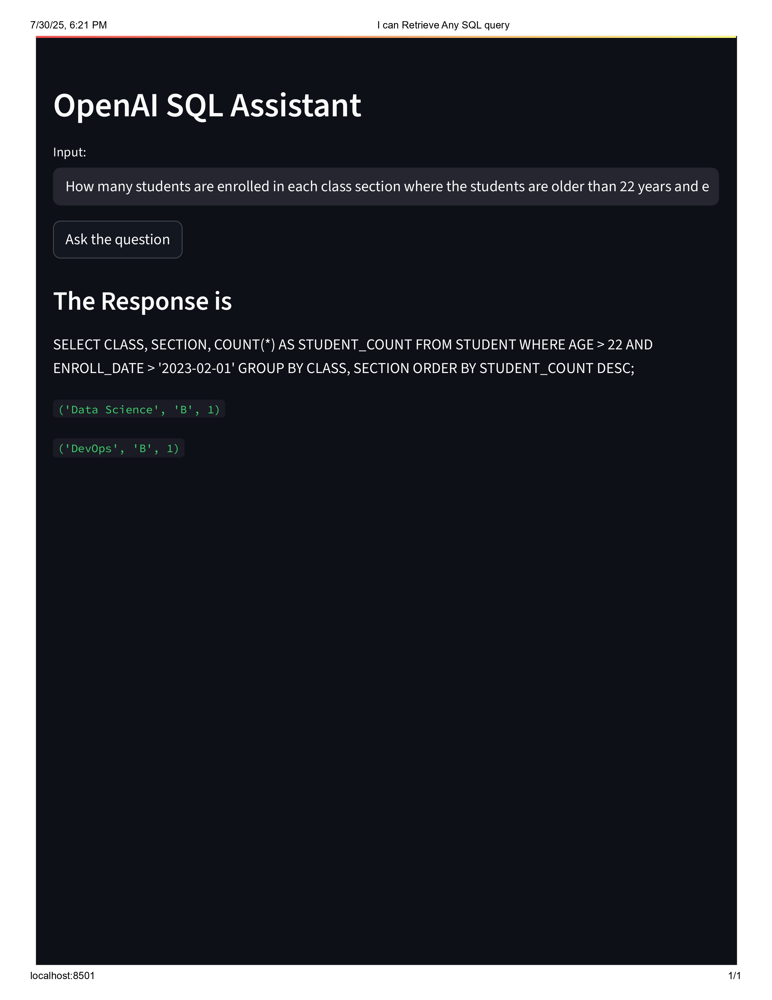

# Text-to-SQL Query Generator using OpenAI and Streamlit

This project is a simple web-based SQL assistant that converts natural language questions into SQL queries using OpenAI's GPT model, executes the query on a SQLite database, and displays the results in a user-friendly Streamlit web interface.


## Features

- Converts user input in plain English to SQL queries.
- Executes the generated SQL queries on a SQLite database.
- Displays query results dynamically in the browser.
- Example prompts provided to guide SQL generation.

## Project Structure

```

text-to-sql/
│
├── .env # OpenAI API key
├── requirements.txt # Python dependencies
├── sql.py # Main Streamlit app
├── sqlite.py # Database setup script
├── test.db # SQLite database
└── snippets/ # (Optional) Directory for code snippets

```

## Prerequisites

- Python 3.8+
- OpenAI API Key (add it to `.env` file as `OPENAI_API_KEY=your-key-here`)

## Installation

1. Clone the repository:

```
git clone https://github.com/yourusername/text-to-sql.git
cd text-to-sql
```


2. Install dependencies:
```

pip install -r requirements.txt

```

3. Set up the SQLite database:
```
python sqlite.py
```


4. Create a .env file and add your OpenAI API key:
```

OPENAI_API_KEY=your-api-key-here
```


## Running the App
```
streamlit run sql.py
```


## Example Questions

How many entries of records are present?

Tell me all the students studying in Data Science class?

List names and emails of students older than 22.

How many students enrolled after February 1, 2023?

## Notes
This project uses OpenAI's GPT-4 model for SQL generation.

Ensure you have API credits/quota on OpenAI.

For production use, always sanitize/validate SQL queries to avoid potential risks.
